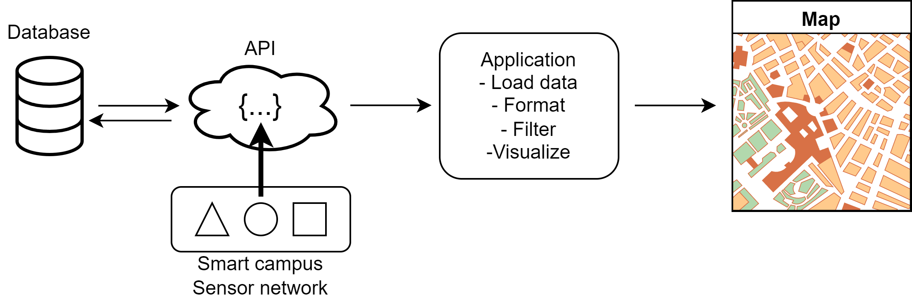
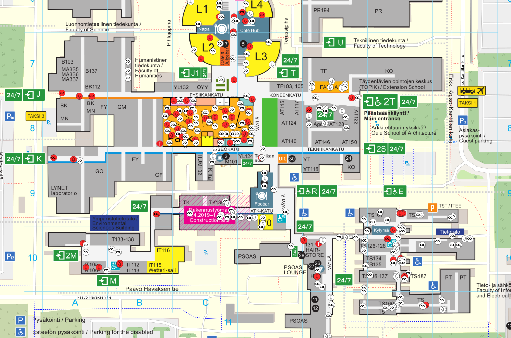

# Wireless Measurements Project 521168S-3003

Welcome to the repository for the Wireless Measurements course project - a Smart Campus Heatmap. The objective of this project is to create a heatmap of the University of Oulu. The map illustrates the amount of movement detected, CO2 levels, temperatures and humidity levels reported by the sensors all around the University of Oulu.

In this repository, you will find all the code and resources necessary to replicate the project and setup your own map. We hope that this project will serve as a valuable resource for anyone interested in wireless measurements and smart campus sensor technology.

<br />

Smart campus : https://smartcampus.fi/oulu/

Smart campus sensor map : https://smartcampus.oulu.fi/manage/map (old map)

Smart campus API page : ~~https://smartcampus.oulu.fi/manage/~~, https://query-webapp.rahtiapp.fi/#/

HOX! SmartCampus Query API has moved forward from public v0.1.0 to v0.4.0 which is hosted in rahtiapp.fi now days.
 

<br />

## Motion heat map based on sensors

The application fetches measurement data from the Smart Campus API, utilizing 24 hour of information gathered from the previous day. The JSON data retrieved from the API is saved as a Pandas DataFrame, with timestamps converted to datetime format for easier processing and analysis.

The application filters out measurements containing NaN, None, or 0.0 values to enhance the quality and accuracy of the visualizations produced. The Folium library's HeatMapWithTime plugin is used to generate dynamic, interactive maps that effectively display the collected data.

A custom layer is added to the map, featuring sensor locations and accompanying HTML popup windows. These windows provide the latest measurement data for each sensor, offering users a comprehensive view of the environment being measured.




# Conda virtual enviroment 

To install libraries using Conda, follow these steps:

1. Open your terminal or Anaconda Prompt.

2. Activate your Conda environment using the command conda activate your_env_name. If you don't have an environment set up, you can create one and install the required packages by using command 'conda create --name your_env_name --file requirements.txt'.

3. Use the 'conda install' command to install the desired library. For example, to install NumPy, use the command conda install numpy.

4. Repeat step 3 for any additional libraries you need.

5. To check which libraries are installed in your environment, you can use the command 'conda list'.

6. When you are finished working with your environment, you can deactivate it using the command 'conda deactivate'.

Note: Conda can also be used to install libraries from non-default channels or to install specific versions of libraries. You can refer to the Conda documentation for more information on these advanced options.

## OR install from requirements.txt

Set up conda enviroment and install requirements with command 'conda install -r requirements.txt'

<br />
<br />

# Setup your Api-key

To be able to get data from the APIs, you will need a functioning Api-key.

1. Go to: https://query-webapp.rahtiapp.fi/#/ and login or create an account
2. Go to "Manage keys" and create an Api-key
3. Create a file named "apikey.py" to your project root folder
4. Add your Api-key in there in the following format, where 'xxxx-xxx-xx-xxx' is your Api-key:
	APIKEY = 'Api-key xxxx-xxx-xx-xxx'
5. All set!
<br />
<br />

# Run the application
Run the application with command

```console
$ C:\WirelessMeasurement> python application.py
```

# Sensor locations map




